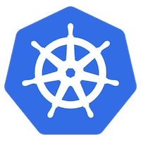

# Deploying an ML Model with Containers and Kubernetes

This project demonstrates deploying machine learning models in the cloud using Docker and Kubernetes. We will be a machine learning model based on the open source wine dataset and then deploying them via a Flask app within a Docker container. 

For this project we are using a Data Science Virtual Machine (Linux) in Azure. In this case I have chose the following machine size:

Standard B2ms (2 vcpus, 8 GB memory)

# Log into the DSVM


```ssh username@yourdsvm.westeurope.cloudapp.azure.com```

It will then ask for your password.

You can open up a browser window with your dsvm ip and port 8000, which is default for Jupyter notebook and start coding there. This is where we will build the model. 

# Model Build: Neural Network (Keras)

A deep learning model was created by following [this](datacamp.com/community/tutorials/deep-learning-python) awesome tutorial from DataCamp. It uses the open source wine dataset. 

I followed it step by step and then saved the model. Keras has it's own save function, which they recommend over using pickle. The code is all in the model folder of this repo. 


# Add extra Port 5000 (DSVM only)

If you are using the DSVM then under the 'Networking' options we need to add another option under 'Inbound Port Rules'. Add port 5000. This is the port where our flask app will run. 

# Building a flask app and Docker image


For this part I used the following tutorial as a reference:

codefresh.io/docker-tutorial/hello-whale-getting-started-docker-flask/

The code for the app.py, Dockerfile and requirements.txt are all in this repo.

You will need to make a folder called flask-app and inside place your app file, your dockerfile and your requirements file. 

Navigate via the cli to the wine folder and then run the following command:

```docker build -t flask-app:latest .```

Now to run the container you need to do:

```docker run -d -p 5000:5000 flask-app```

If you want to stop a docker container then you can use the command:

```docker stop appname```

Be sure to use the name of the container and not the image name, otherwise it won't stop. Docker assigns it's own weird and wonderful names unless you specify otherwise using the --name attribute. 

e.g 

```docker run -d -p 5000:5000 --name yourcontainername yourimage```


# Push to Docker Hub

Run the docker image 

```docker run -d -p 5000:5000 flask-app```

Now we need to check out which images we have available using:

```docker images```

You will need to log in to docker hub using the following command:

```docker login --username username```

You will be prompted to enter your password. 

Then we are going to run the following commands to tag and push the image into the repo.

```docker tag <your image id> <your docker hub username>/<repo name>```

```docker push <your docker hub name>/<repo name>```
e.g
```docker push josiemundi/flask-app```

# Kubernetes



You will need to have your resource group for aks. Run the following command to connect to it:

```az aks get-credentials --resource-group <your resource group> --name <your aks cluster>```

Then you can run your docker image using the following command:

```kubectl run wine-app --image=josiemundi/flask-app:latest --port 5000```

If you type:

kubectl get pods you can see the status of your pod. It can take a couple of a minutes for a pod to get up and running.

To expose your app to an external ip you can use:

```kubectl expose deployment wine-app --type=LoadBalancer --port 80 --target-port 5000```

You can check the status of the external ip by using the command:

```kubectl get service```

This can also take a couple of minutes. Once you have an external ip you can head on over to it and see your app running! 


To delete your deployment use:

```kubectl delete deployment <name of deployment>```
 

